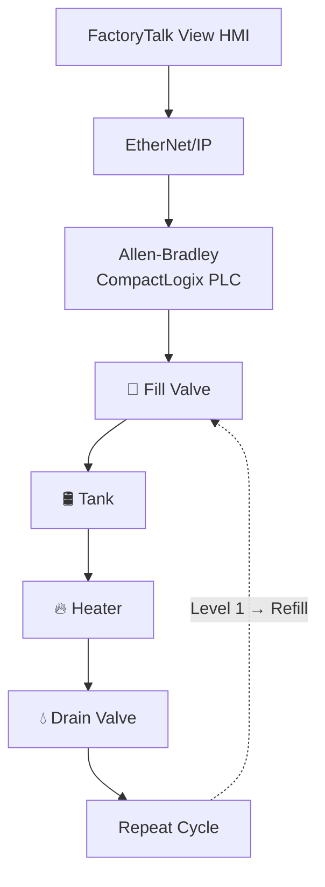

<!-- HERO IMAGE -->

  

<h1 align="center">Industrial Water Tank Process Control System</h1>

  Industrial PLC automation system that continuously controls tank filling, heating, and drainage using state-based ladder logic, analog level simulation, and FactoryTalk View HMI supervision.

  
  
  
  
  
  
  
  

---

## ▶️ Demo

[▶ water tank demo.mp4](water%20tank%20demo.mp4)

Full continuous fill, heat, and drain cycle running on the HMI.

---

## 📌 Project Overview

An industrial process-control application that continuously fills a tank to a high-level setpoint, performs a timed heating cycle, and drains the tank to a low-level setpoint before automatically repeating.

The project demonstrates state-based process automation, analog level simulation, timer sequencing, process interlocks, and HMI development using Allen-Bradley CompactLogix and FactoryTalk View.

### 🎯 Control Objectives

- Automatically fill the tank to level 99.
- Stop filling and hold a 10-second heat cycle at level 99.
- Drain the tank to level 1 once heating completes.
- Prevent the fill and drain valves from ever operating at the same time.
- Restart the cycle automatically and run the process continuously.

---

## ⭐ Project Highlights

| Feature | Value |
|---------|-------|
| **Process** | Continuous Fill → Heat → Drain Cycle |
| **PLC** | Allen-Bradley CompactLogix 5370 |
| **HMI** | FactoryTalk View + PanelView Plus |
| **IDE** | Studio 5000 Logix Designer |
| **Communication** | EtherNet/IP |
| **Control Type** | Analog Level, Timer-Based State Control |
| **Testing** | Validated on Allen-Bradley Hardware |

---

## ✨ Features

- ✔ Automatic Filling
- ✔ Automatic Draining
- ✔ Automatic Heating
- ✔ Continuous Process Cycling
- ✔ Analog Tank-Level Simulation
- ✔ Heater Timer (10 s)
- ✔ Process Sequencing
- ✔ State-Based Automation
- ✔ Live HMI Monitoring

---

## 🏗️ System Architecture

Fill raises the level to 99, which stops filling and starts the 10-second heat; draining lowers the level to 1, which closes the drain and restarts the fill. The loop repeats continuously.

---

## ⚙️ PLC Logic

### Fill State

The process is state-driven, and in **State 0** (fill) the fill valve is energized. A self-resetting `TON`, gated by its own `.DN` bit, generates a repeating pulse whose done bit increments the `water_level` tag by 1 through an `ADD`, simulating the analog level rising. Once the level reaches **99**, the logic moves `tank_state` to 1, advancing to the heat stage.

---

### Heat State

In **State 1** the heater is energized and a `TON` runs a 10-second (`10000 ms`) cycle. When `heat_timer.DN` sets, the logic moves `tank_state` to 2, advancing to the drain stage.

---

### Drain State

When heating completes, the heater turns off and the drain valve opens until the level reaches the low setpoint (1). The fill and drain valves are interlocked so they never operate together.

---

### Automatic Reset

At level 1, the drain valve closes and filling restarts, cycling the process continuously with no operator input.

---

### Full PLC Logic Walkthrough

[▶ water tank-ladder logic.mp4](water%20tank-ladder%20logic(1).mp4)

A complete rung-by-rung walkthrough of the routine, showing the state machine advance through fill, heat, drain, and automatic reset live, with the analog level, timers, and valve interlock updating in real time.

---

## 🧠 Engineering Challenges

- **<ins>Maintaining continuous process flow</ins>**: sequencing the loop so it restarts cleanly and runs indefinitely without stalls.
- **<ins>Coordinating fill, heat, and drain stages</ins>**: handing each stage off to the next based on level values and the heat timer.
- **<ins>Preventing simultaneous fill and drain</ins>**: interlocking the valves so the two states can never energize together.
- **<ins>Automatic cycling</ins>**: returning to the fill state at level 1 with no manual reset.
- **<ins>Clean ladder organization</ins>**: keeping the whole process in one readable, maintainable routine.

---

## ✅ Testing & Validation

| Function | Status |
|----------|:------:|
| Tank Filling | ✅ Verified |
| Water Level Control | ✅ Verified |
| Maximum Level Detection | ✅ Verified |
| Heater Operation | ✅ Verified |
| 10-Second Heating Cycle | ✅ Verified |
| Tank Drainage | ✅ Verified |
| Minimum Level Detection | ✅ Verified |
| Fill/Drain Interlock | ✅ Verified |
| Automatic Restart | ✅ Verified |
| HMI Communication | ✅ Verified |
| PLC Communication | ✅ Verified |

---

## 📈 Results

- ✔ Developed a complete PLC program for a continuous fill, heat, and drain process
- ✔ Implemented analog tank-level simulation with high and low setpoint control
- ✔ Designed timer-based, state-driven ladder logic with automatic cycling
- ✔ Interlocked the fill and drain valves to prevent conflicting operation
- ✔ Built a FactoryTalk View HMI with live tank animation and process status
- ✔ Verified continuous automatic operation on physical Allen-Bradley hardware
- ✔ Designed a continuous process-control application capable of autonomous operation without operator intervention

---

## 🛠️ Technical Skills Demonstrated

---

## 👤 About the Author

**Anil Pantula**, Electrical Engineering Student, University of Windsor
Automation Technician Co-op @ Asamaka Industries Ltd.

Pursuing roles in Industrial Automation · Controls Engineering · PLC Programming · Robotics · Mechatronics

<!-- Add LinkedIn / email links here -->

Engineering portfolio project. Not an open-source software library.

