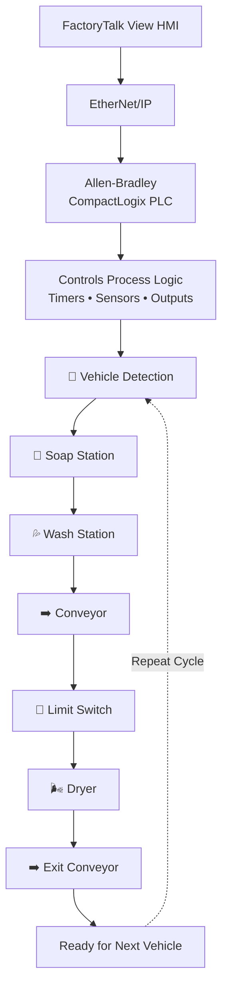

<!-- HERO IMAGE: replace with a wide HMI / process overview screenshot -->

  

<h1 align="center">Industrial Car Wash Automation System</h1>

  Allen-Bradley CompactLogix PLC control system that automatically detects a vehicle and executes a full soap → wash → dry sequence with timer-based, state-driven control and FactoryTalk View HMI supervision.

  
  
  
  
  
  
  
  

---

## ▶️ Demo

<!-- Replace with an embedded GIF or a linked MP4/YouTube walkthrough. GIFs autoplay inline on GitHub. -->

  

---

## 📌 Project Overview

An Allen-Bradley CompactLogix PLC system that fully automates an industrial car wash, from vehicle detection through soap, wash, dry, and exit, with no operator input.

### 🎯 Control Objectives

- Automatically detect an incoming vehicle before the cycle starts.
- Run the full soap, wash, and dry sequence without operator intervention.
- Prevent overlapping stages so only one operation is ever active at a time.
- Position the vehicle using conveyor motion and limit-switch feedback.
- Time each stage with independent presets that trigger the next step automatically.
- Stop instantly and de-energize every output on Master Stop.
- Return to the ready state (State 0) automatically for the next vehicle.

---

## ⭐ Project Highlights

| Feature | Value |
|---------|-------|
| **Process** | Fully Automatic Soap → Wash → Dry Cycle |
| **PLC** | Allen-Bradley CompactLogix 5370 |
| **HMI** | FactoryTalk View + PanelView Plus |
| **IDE** | Studio 5000 Logix Designer |
| **Communication** | EtherNet/IP |
| **Control Type** | Sequential, Timer-Based State Control |
| **Testing** | Validated on Allen-Bradley Hardware |

---

## ✨ Features

- ✔ Automatic Vehicle Detection
- ✔ Sequential Process Control (Soap → Wash → Dry)
- ✔ Timer-Based Cycle Control
- ✔ Conveyor Motor Control
- ✔ Limit-Switch Positioning
- ✔ Automatic State Transitions
- ✔ Process Interlocks
- ✔ Master Start / Master Stop Safety
- ✔ Automatic Reset for Next Vehicle
- ✔ Live HMI Monitoring

---

## 🏗️ System Architecture

Master Start arms the system; vehicle detection triggers the sequence; each stage advances on a preset timer or limit switch; Master Stop de-energizes all outputs immediately.

---

## ⚙️ PLC Logic

### Sequential Process, Timers, Vehicle Detection & Dryer

<!-- 📷 replace with the ladder screenshot containing the full sequence -->

The core routine runs the full wash cycle as timer-driven state logic:

- **Vehicle Detection**: with the system armed, the car-detection sensor is the permissive that launches the cycle, preventing any start on an empty bay.
- **Sequential States**: steps soap → wash → dry → exit in a fixed order; each stage energizes only after the previous one completes, so operations never overlap.
- **Timers**: independent soap, wash, and dry presets set each stage's duration, and their timer-done bits drive the automatic transition to the next state.

<!-- 🎥 -->
[▶ ProcessLogic.mp4](Videos/ProcessLogic.mp4)

---

### Automatic Reset

<!-- 📷 replace with ladder screenshot of the reset routine -->

Once the vehicle exits the bay, the **Car Out** condition (`Car_Out.DN`) is activated. This energizes the OTE that resets the car wash sequence back to **State 0**, the beginning, clearing all active states and returning the system to ready, automatically armed for the next vehicle with no operator input.

<!-- 🎥 -->
[▶ Reset.mp4](Videos/Reset.mp4)

---

### Master Stop Safety Logic

<!-- 📷 replace with ladder screenshot of the Master Stop routine -->

Master Stop is evaluated ahead of all process logic. Pressing it immediately halts the sequence and de-energizes every output regardless of the current state.

<!-- 🎥 -->
[▶ MasterStop.mp4](Videos/MasterStop.mp4)

---

## 🧠 Engineering Challenges

- **Maintaining correct process order**: enforcing a strict soap → wash → dry → exit sequence with no skipped or out-of-order stages.
- **Preventing overlapping operations**: ensuring only one station is active at a time so outputs never energize simultaneously.
- **Coordinating multiple timers**: sequencing independent soap, wash, and dry timers so each hands off cleanly to the next.
- **Ensuring automatic reset**: returning the system to the ready state so the next vehicle runs with no manual intervention.
- **Creating reusable ladder logic**: structuring the program into clean, state-driven routines that are easy to debug and extend.

---

## ✅ Testing & Validation

| Function | Status |
|----------|:------:|
| Master Start | ✅ Verified |
| Vehicle Detection | ✅ Verified |
| Soap Cycle | ✅ Verified |
| Wash Cycle | ✅ Verified |
| Conveyor Movement | ✅ Verified |
| Limit Switch | ✅ Verified |
| Dryer Cycle | ✅ Verified |
| Master Stop | ✅ Verified |
| HMI Communication | ✅ Verified |
| PLC Communication | ✅ Verified |

---

## 📈 Results

- ✔ Developed a complete PLC program for a fully automatic car wash sequence
- ✔ Designed timer-based, state-driven ladder logic with automatic transitions
- ✔ Integrated vehicle-detection and limit-switch sensing for positioning
- ✔ Built a FactoryTalk View HMI for real-time process monitoring
- ✔ Verified PLC I/O and HMI communication on physical Allen-Bradley hardware
- ✔ Validated the full cycle, automatic reset, and Master Stop safety response

---

## 🛠️ Technical Skills Demonstrated

---

## 👤 About the Author

**Anil Pantula**, Electrical Engineering Student, University of Windsor
Automation Technician Co-op @ Asamaka Industries Ltd.

Pursuing roles in Industrial Automation · Controls Engineering · PLC Programming · Robotics · Mechatronics

<!-- Add LinkedIn / email links here -->

Engineering portfolio project. Not an open-source software library.

